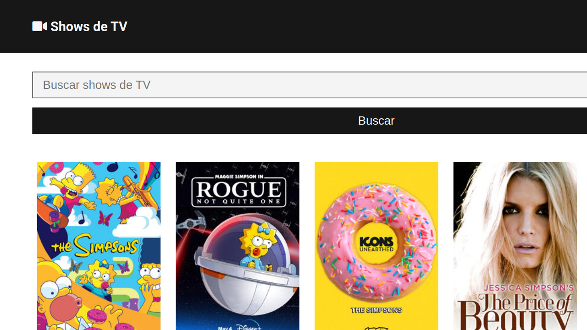
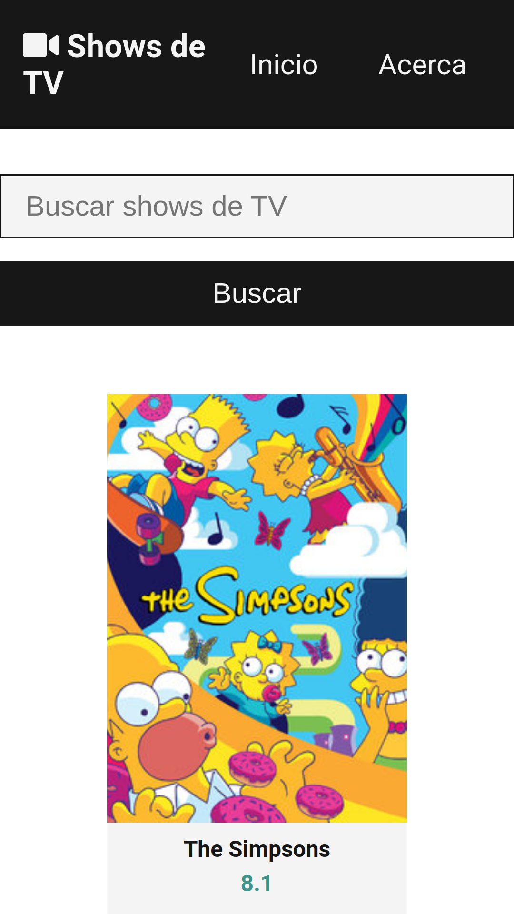

# TV Shows App

## Descripción

Código base de la aplicación TV Shows App hecha en React.js que utiliza la API de TVmaze.

---

## Vista En Versión Desktop

## Vista En Versión Mobile

---

## Enlace A La Aplicación

- [TV Shows](https://axe10rellana.github.io/tvshowsapp/tvshowsapp/#/)

---

## Hecho con

- [React](https://react.dev/) - JS library
- [Tailwind CSS](https://tailwindcss.com/) - For Styles

---

## Comandos

- npm i
- npm start
- npm run build

---

## Dependencias

- Axios
- React
- react-router-dom
  
---

## Autor

- Website - [Axe10rellana](https://axe10rellana.github.io/portafolio/portafolio/)
